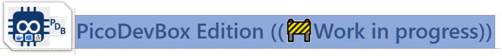
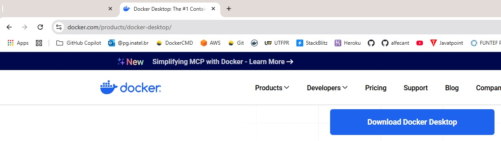
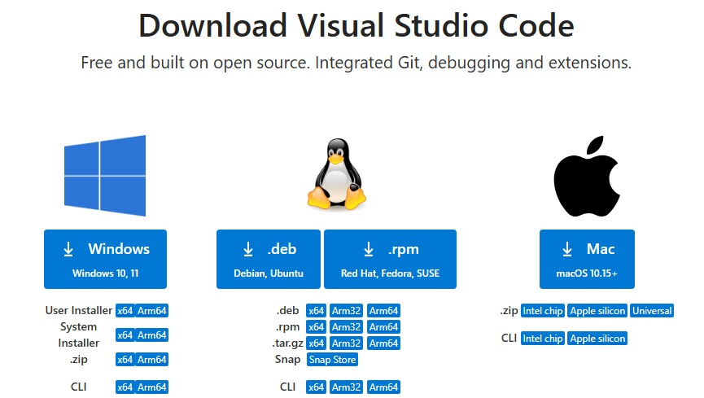
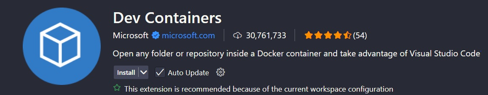
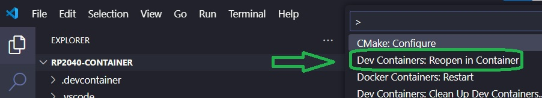
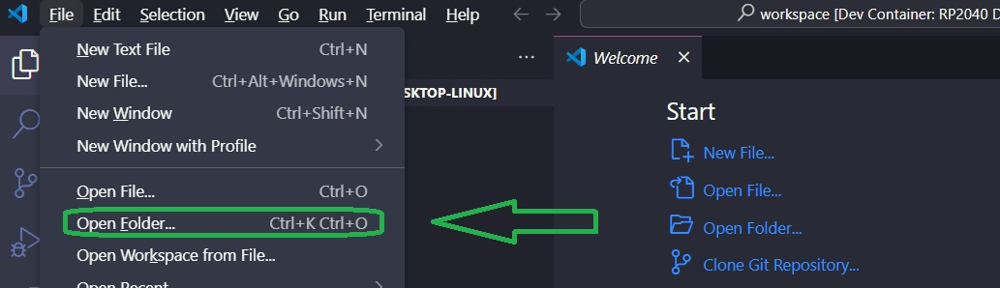
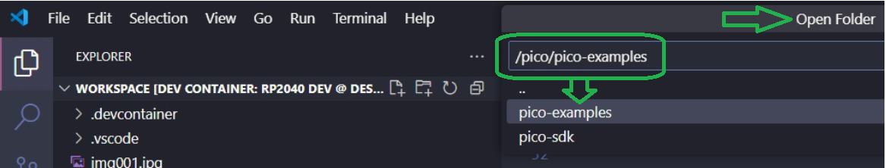

<p align="center">
  
</p>

## 🐳 Run in a Containerized Environment

Tired of manual setups and toolchain installations? Want to skip the setup and run the projects in a ready-to-use development environment?

🚀 **Launch all projects using our custom Docker image with full Pico SDK support!**  
The image includes build tools, dependencies, and sample projects — all pre-configured.

A complete and professional Docker-based development environment for the **Raspberry Pi Pico (RP2040)** — curated and maintained by [alfecjo](https://alfecjo.github.io/).

---

## ✅ Supported Boards — PicoDevBox Compatibility

The **PicoDevBox** environment includes the official [Raspberry Pi `pico-sdk`](https://github.com/raspberrypi/pico-sdk), making it fully compatible with all development boards based on the **RP2040** chip.

### 🧠 Officially Supported Boards

| 📦 Board Name                     | ⚙️ Chip     | 🌐 Connectivity     | 💡 Notes                          |
|----------------------------------|-------------|---------------------|-----------------------------------|
| BitDogLab - Escola 4.0           | RP2040      | ✅ Wi-Fi (CYW43439) | Built-in Wi-Fi supported via SDK |
| Raspberry Pi Pico                | RP2040      | ❌ None              | Base model                        |
| Raspberry Pi Pico H              | RP2040      | ❌ None              | Pico + pre-soldered header        |
| Raspberry Pi Pico W              | RP2040      | ✅ Wi-Fi (CYW43439) | Built-in Wi-Fi supported via SDK |
| Raspberry Pi Pico WH             | RP2040      | ✅ Wi-Fi             | Pico W + pre-soldered header      |
| Adafruit Feather RP2040         | RP2040      | ❌ (external)        | Fully SDK-compatible              |
| Seeed Studio XIAO RP2040        | RP2040      | ❌                   | Ultra-compact                     |
| SparkFun Pro Micro RP2040       | RP2040      | ❌                   | SDK-compatible board              |
| Arduino Nano RP2040 Connect     | RP2040      | ✅ Wi-Fi + BT        | Partial support (Arduino libs)   |
| WaveShare RP2040 boards         | RP2040      | ❌ / partial         | Compatible with minor tweaks      |


> ❗️ **Exceptions / Partial Support:**
> 
> Boards like the **Arduino Nano RP2040 Connect**, although based on the same RP2040 chip, include different peripherals (such as sensors and Wi-Fi/Bluetooth connectivity) that are not fully supported by the official Raspberry Pi SDK.  
> However, they can still be used by adding additional libraries.

---

### 🧰 What Can You Do?

- 🛠️ Build, compile, and flash firmware for all supported RP2040 boards.
- 📡 Develop Wi-Fi-enabled applications with **Pico W** (via built-in `pico-cyw43-driver`).
- 🚀 Start prototyping in C/C++ right away using **Visual Studio Code** inside a fully containerized environment.

> ℹ️ Some boards like **Arduino Nano RP2040 Connect** require extra libraries for full support of wireless features.

---

### 🔗 Related Resources

- [pico-sdk Documentation](https://raspberrypi.github.io/pico-sdk-doxygen/)
- [CYW43 Wi-Fi Driver](https://github.com/raspberrypi/pico-sdk/tree/master/lib/)
- [Pico Examples](https://github.com/raspberrypi/pico-examples)


---

## ✅ What's Included

Everything you need for RP2040 firmware development using **Visual Studio Code Dev Containers**:

- 🛠️ Raspberry Pi Pico SDK (with `pico-examples`)
- 💸 `gcc-arm-none-eabi` toolchain v10.3
- 🔧 Precompiled `picotool`
- ⚙️ CMake, Ninja, and multiarch GDB
- 🐍 Python 3 + `pip`, `setuptools`, and dev packages
- 🧠 Auto-mount `.vscode` settings to examples
- 🐧 Ubuntu 24.04 base
- 👤 Preconfigured `dev` user with proper permissions

---

## 💡 Why Dev Containers?

This image is **purpose-built for Dev Containers**, giving you:

- 👨‍💻 Reproducible builds
- 🚀 Rapid onboarding
- 🍀 Fully portable environments
- 💻 Consistent toolchains across teams and OSes

---

## 🚀 Quick Start Guide

### ✅ Requirements

| Tool            | Link                                  |
|-----------------|---------------------------------------|
| Docker DeskTop  | https://www.docker.com/               |
| VS Code         | https://code.visualstudio.com/        |
| Dev Containers  | Extension by Microsoft                |

---


---


---


---

### 🔧 Cloning and Launching

```bash
git clone https://github.com/alfecjo/rp2040-container.git
cd rp2040-dev
code .
```

### 📁 When prompted by VS Code, click "Reopen in Container".







### 🎥 Installation Walkthrough (Video)
Want to see how to get started from scratch?
Watch this quick video guide that walks you through setting up the development environment using Docker, Visual Studio Code, and all required dependencies — running fully inside a persistent container:

[](https://www.youtube.com/watch?v=_GeK1iBx_gQ)

---

## Related Projects

Want to learn more about this project?

- 👇 Check out the example below by clicking the button:

  **[](https://github.com/BitDogLab)**
 
---

- ## Return to the main page
  [](https://github.com/alfecjo/antonio_almeida_embarcatech_HBr_2025)
