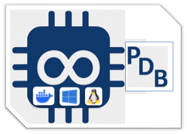

# 🐾 PicoDevBox Edition ((🚧Work in progress))

****

## 🐳 Run in a Containerized Environment

Tired of manual setups and toolchain installations? Want to skip the setup and run the projects in a ready-to-use development environment?

🚀 **Launch all projects using our custom Docker image with full Pico SDK support!**  
The image includes build tools, dependencies, and sample projects — all pre-configured.

A complete and professional Docker-based development environment for the **Raspberry Pi Pico (RP2040)** — curated and maintained by [alfecjo](https://alfecjo.github.io/) for use with the **Raspberry Pi Pico** or **BitDogLab** boards.

---

## ✅ What's Included

Everything you need for RP2040 firmware development using **Visual Studio Code Dev Containers**:

- 🛠️ Raspberry Pi Pico SDK (with `pico-examples`)
- 💸 `gcc-arm-none-eabi` toolchain v10.3
- 🔧 Precompiled `picotool`
- ⚙️ CMake, Ninja, and multiarch GDB
- 🐍 Python 3 + `pip`, `setuptools`, and dev packages
- 🧠 Auto-mount `.vscode` settings to examples
- 🐧 Ubuntu 24.04 base
- 👤 Preconfigured `dev` user with proper permissions

---

## 💡 Why Dev Containers?

This image is **purpose-built for Dev Containers**, giving you:

- 👨‍💻 Reproducible builds
- 🚀 Rapid onboarding
- 🍀 Fully portable environments
- 💻 Consistent toolchains across teams and OSes

---

## 🚀 Quick Start Guide

### ✅ Requirements

| Tool            | Link                                  |
|-----------------|---------------------------------------|
| Docker DeskTop  | https://www.docker.com/               |
| VS Code         | https://code.visualstudio.com/        |
| Dev Containers  | Extension by Microsoft                |

---


---


---


---

### 🔧 Cloning and Launching

```bash
git clone https://github.com/alfecjo/rp2040-container.git
cd rp2040-dev
code .
```

### 📁 When prompted by VS Code, click "Reopen in Container".


### 🎥 Installation Walkthrough (Video)
Want to see how to get started from scratch?
Watch this quick video guide that walks you through setting up the development environment using Docker, Visual Studio Code, and all required dependencies — running fully inside a persistent container:

[](https://www.youtube.com/watch?v=_GeK1iBx_gQ)

---

## Related Projects

Want to learn more about projects? 

- 👇 Check out the example below by clicking the button:

  **[]([https://link-para-o-seu-projeto](https://github.com/BitDogLab))**
 
---

- ## Return to the main page
  [](https://github.com/alfecjo/antonio_almeida_embarcatech_HBr_2025)
